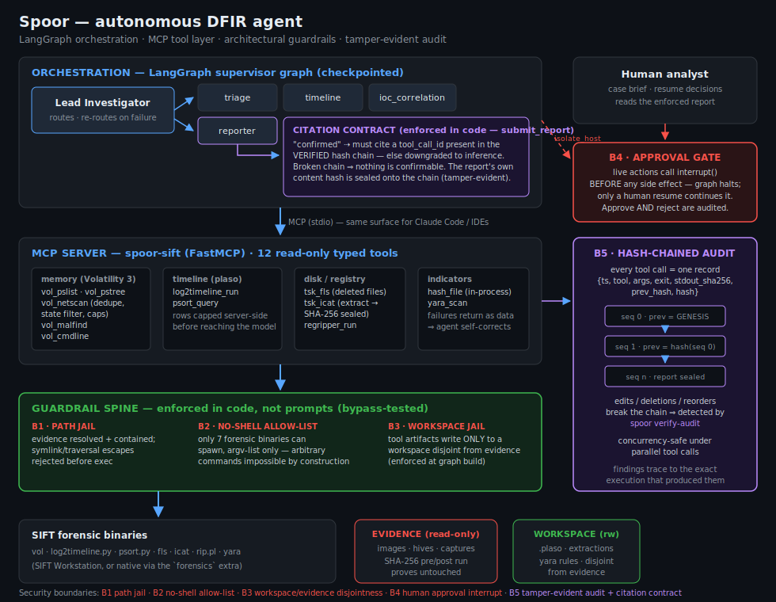

# Spoor

> An autonomous DFIR agent that follows the forensic trail an intruder leaves behind — and runs it to ground.

Spoor drives SANS SIFT forensic tooling (Volatility 3, Sleuth Kit, RegRipper, plaso, YARA) through a purpose-built **MCP server**, orchestrated by a **LangGraph multi-agent graph** — a Lead Investigator routing triage, timeline, IOC-correlation, and reporter specialists over a shared case state. Every claim it makes is either **backed by a verifiable tool execution or explicitly labeled an inference** — enforced in code, not in a prompt.

Built for the SANS **"FIND EVIL!"** hackathon (Devpost, 2026). Python · MCP · LangGraph · SIFT.

*Spoor*: the track or scent trail an animal leaves — you follow the spoor to hunt the quarry. Here: follow forensic artifacts to the threat.

<p align="center"></p>

## Why trust it? (the part that's different)

LLM agents hallucinate; incident reports can't. Spoor's answer is architectural:

| Boundary | Enforcement | Where |
|---|---|---|
| **B1 — Path jail** | every evidence path is resolved (symlinks included) and must live under the read-only evidence root | `guardrails.py` |
| **B2 — No-shell allow-list** | only 7 forensic binaries can ever spawn, argv-list only — arbitrary commands are impossible by construction | `guardrails.py`, `runner.py` |
| **B3 — Workspace jail** | tool artifacts (extractions, timelines) write only to a workspace **disjoint** from evidence | `guardrails.py`, enforced at graph build |
| **B4 — Approval gate** | live actions call `interrupt()` **before any side effect**; only a human resume continues the graph; approve *and* reject are audited | `orchestration/gate.py` |
| **B5 — Tamper-evident audit** | every tool call appends a hash-chained record; edits, deletions, reorders are detected by `spoor verify-audit` | `audit.py` |

On top of B5 sits the **citation contract**: a finding may claim *confirmed* only by citing a `tool_call_id` that exists in the **verified** chain. Missing or fabricated citations are downgraded to inferences — deterministically, in `submit_report`'s implementation (`orchestration/report.py`). A broken chain voids every confirmed claim. The final report's own content hash is sealed onto the chain.

All five boundaries ship with **bypass tests** (`tests/test_guardrails.py`, `tests/test_gate.py`, `tests/test_report.py`) — try them live with `make guardrails`.

## Quick start

```bash
# prereqs: uv (https://docs.astral.sh/uv/), Python 3.12+
git clone https://github.com/RECTOR-LABS/spoor && cd spoor
make install                       # deps incl. Volatility 3 (the 'forensics' extra)
cp .env.example .env               # add SPOOR_OPENROUTER_API_KEY (or OPENROUTER_API_KEY)

make test                          # 112 tests
make demo                          # full multi-agent live run (canned Case-001 demo scenario)
make verify-audit                  # prove the run's hash chain is intact
```

`make demo` exercises the complete graph — supervisor routing, real models, the
citation contract, a rigged tool failure the agent must recover from — against a
canned, Case-001-shaped evidence layer (no big downloads needed).

### Watch it (silent walkthrough)

```bash
./scripts/demo_walkthrough.sh          # $0 — runs off the committed real run
```

Prints the full submission story beat-by-beat: the verdict (`spoor show-report`),
the tamper-evident audit (`spoor verify-audit`), guardrail-bypass attempts that
fail (`spoor demo-guardrails`), and the honest accuracy number. The live
autonomous run is `make real`.

## The real run (real evidence, real accuracy)

Spoor is scored against **DFIR Madness Case 001 — "The Stolen Szechuan Sauce"**, a
public intrusion case with a published answer key (see [`datasets/README.md`](datasets/README.md)):

```bash
# fetch the DC01 memory image (2.1GB) and verify its published MD5 — see datasets/README.md
make real
```

This drives **real Volatility 3** over the real 2.1GB domain-controller memory
capture, end to end: autonomous triage → IOC correlation → enforced report →
**[`accuracy_report.md`](accuracy_report.md)** with precision/recall/F1, a
hallucination rate, and an **evidence-integrity proof** (SHA-256 of the image
before and after the run — read-only operation, demonstrated empirically).

## Autonomy & self-correction

Tool failures return to the model as *data* (the failed call is still audited), so
the agent reasons about the cause and retries — emergent behavior, not a scripted
retry loop. The committed run logs show it live: `vol_malfind` fails, the agent
finishes its sweep, comes back, retries, recovers (`runs/*/audit.jsonl`, seq 4–5
in the demo run). A deterministic **completeness gate** re-engages the supervisor
on its checkpointed thread if a run ever tries to conclude without an enforced
report.

## The toolset (12 read-only tools, one audited spine)

| Family | Tools | Notes |
|---|---|---|
| Memory (Volatility 3) | `vol_pslist` `vol_pstree` `vol_netscan` `vol_malfind` `vol_cmdline` | pstree flattened; netscan deduped + state-filterable; all row-capped server-side |
| Timeline (plaso) | `log2timeline_run` `psort_query` | build once into the workspace, slice many; events capped before they reach the model |
| Disk (Sleuth Kit) | `tsk_fls` `tsk_icat` | deleted entries surfaced; extractions hashed at the moment of extraction (custody sealed) |
| Registry (RegRipper) | `regripper_run` | hives from evidence or carved into the workspace |
| Indicators | `hash_file` `yara_scan` | hashing is in-process (no subprocess, no parsing); rules live in the workspace jail |

Every tool: typed inputs → guardrails → no-shell runner → hash-chained audit record → structured JSON out.

## Use it from Claude Code / any MCP client

The same tools the agents use are served over MCP (stdio):

```jsonc
// .mcp.json / claude_desktop_config.json
{
  "mcpServers": {
    "spoor-sift": {
      "command": "uv",
      "args": ["--directory", "/ABS/PATH/spoor", "run", "spoor-sift"],
      "env": {
        "EVIDENCE_ROOT": "/cases/case001",
        "SPOOR_WORKSPACE": "/cases/workspace",
        "SPOOR_AUDIT_PATH": "runs/audit.jsonl"
      }
    }
  }
}
```

## Repository map

```
spoor_sift/
  audit.py              hash-chained, tamper-evident audit log (+ verify)
  guardrails.py         path jail · binary allow-list · workspace disjointness
  runner.py             no-shell subprocess runner (text + raw-bytes modes)
  accuracy.py           precision/recall/F1 + hallucination rate vs. an answer key
  cli.py                spoor verify-audit | demo-guardrails | accuracy-report
  server.py             spoor-sift MCP server (FastMCP, stdio)
  tools/                memory · timeline · disk · registry · indicators
  orchestration/
    supervisor.py       Lead Investigator graph (create_supervisor + checkpointer)
    agents.py           triage / timeline / ioc_correlation / reporter specialists
    report.py           the citation contract + the enforcing submit_report tool
    gate.py             interrupt() approval gate for live actions
    tools.py            typed LangChain adapters over the audited core
scripts/                live demo run · real-evidence run
datasets/               Case 001 docs, fetch instructions, verified ground truth
runs/                   committed run artifacts: audit logs, reports, tokens, transcripts
tests/                  112 tests, TDD-first (incl. guardrail bypass attempts)
```

## Honest limitations

- **Memory path is fully native** (pure-Python Volatility 3). The plaso/Sleuth Kit/RegRipper
  binaries ship on the SANS SIFT Workstation — on a bare laptop the timeline/disk/registry
  tools surface as self-correctable "binary not found" errors unless you install them.
- The committed **demo** run uses a canned, Case-001-shaped evidence layer to exercise the
  full four-specialist graph cheaply; the **real** run (`make real`) is genuine end-to-end
  and produces the scored accuracy report.
- Spoor's authors are agent engineers, not career forensic analysts; the methodology encoded
  in the prompts follows the SANS-published triage playbook, and accuracy is *measured*
  against a public answer key rather than asserted.

## License

MIT — see [`LICENSE`](LICENSE).
